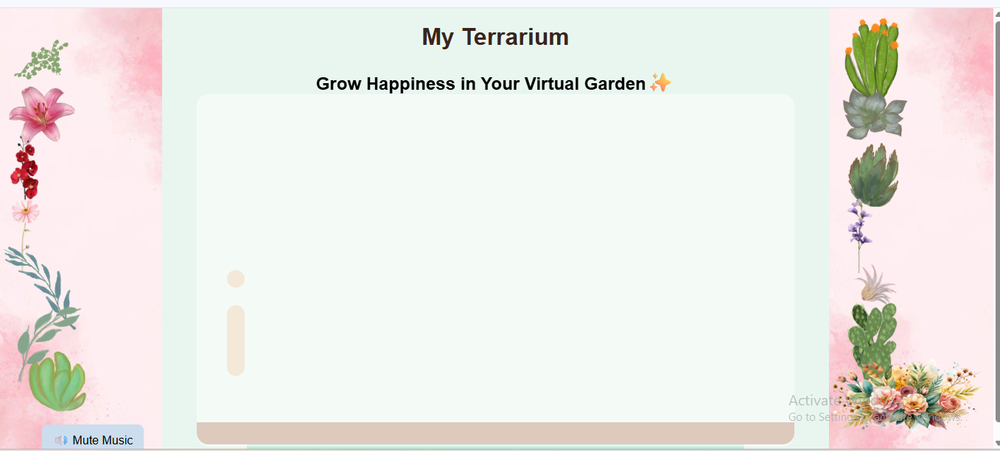

 # 🌿 My Virtual Terrarium

Ever wanted to grow a tiny garden... in your browser?  
This interactive web project lets users **drag and drop plants into a virtual terrarium**, complete with background music and a mute/unmute button.

---

## ✨ Features

- Drag & drop plants into the terrarium
- Background music that plays on user click
- Mute/Unmute toggle button
- Fully responsive layout for different devices
- Aesthetic pastel theme

---

## 🌸 Demo Screenshot

---

## 🛠️ Tech Stack

- HTML5
- CSS3
- JavaScript

---

## 📌 About This Project

This project was originally inspired by a web development course on LinkedIn and a project from Web Dev Simplified. I used it as a learning opportunity to implement my own ideas including:
- Custom plant & flower replacements
- Theme redesign
- Background music integration
- Mute/unmute functionality

---

## 🚀 Deployment

This project is live on Netlify:  
👉 [my-terrarium.netlify.app](https://myterrarium.netlify.app/)

---

## 🙋‍♀️ Author

**Nimra Batool**  
[GitHub Profile](https://github.com/batoolnimra)

---

